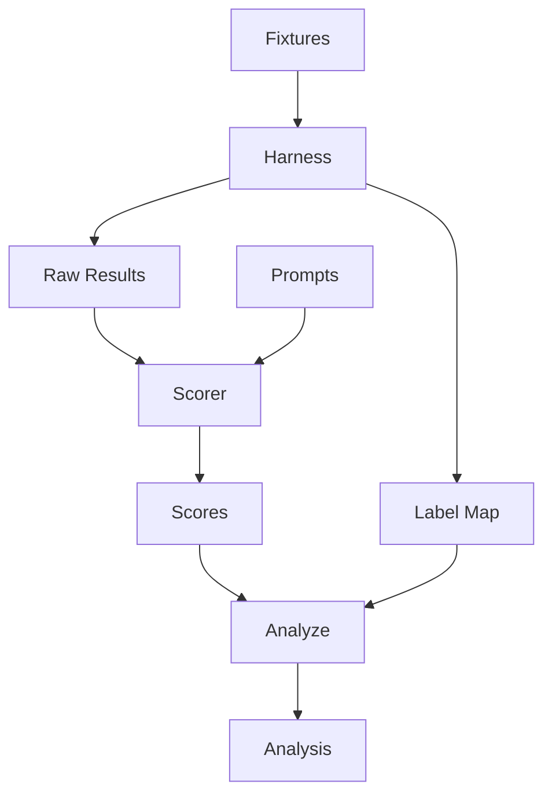

<div align="center">

# MCP Parameter-Description Ablation

[](LICENSE)
[](experiments/exp1-analyze-symbol/analysis.json)

Does moving parameter-level detail out of an MCP tool's description string and into
`inputSchema.properties[*].description` regress parameter-filling accuracy, especially for
smaller models?

Supplementary data repository for an MCP parameter-description ablation experiment. Companion
blog post: TBD.

</div>

## Status

**No detectable parameter-filling regression at two scoring resolutions; a significant,
consistent token-cost reduction for both models.** The full 320-call run
(`recipe/harness.py`) executed and was blind-scored (`recipe/scorer.py`, `recipe/analyze.py`;
see [PR #10](https://github.com/clouatre-labs/param-description-experiments/pull/10)). The
pre-registered primary test (Mann-Whitney U, cell C, lean tool description, current
production text, vs cell A, rich tool description, param-fill score, two-tailed alpha=0.05,
per model) found no significant difference:

*Table 1: Mann-Whitney U results per model, primary comparison (cell C, lean description, vs
cell A, rich description), param-fill score, two-tailed alpha=0.05, n=40 per cell.*

| Model | U | p | r | n/cell |
|---|---|---|---|---|
| claude-haiku-4-5-20251001 | 720 | 0.372 | 0.10 | 40 |
| claude-sonnet-5 | 820 | 0.569 | -0.025 | 40 |

Cell A reconstructs the tool-description text that predates
[aptu-coder PR #593](https://github.com/clouatre-labs/aptu-coder/pull/593), which moved
per-parameter constraint detail out of MCP tool-description strings into per-field doc
comments, cutting serialized tool-description tokens by roughly 45%. Cell C is the current,
post-PR-#593 production text. `import_lookup` and `def_use` did not exist before PR #593, so
cell A's prose for those two parameters was extended to match the level of detail the other
parameters had pre-PR-#593.

No detectable parameter-filling regression from moving `analyze_symbol`'s param detail out of
the tool description and into `inputSchema.properties[*].description`, for either model.
Exploratory data (cells B/D, tool-selection accuracy, serialized tools-list token cost) is in
[`experiments/exp1-analyze-symbol/analysis.json`](experiments/exp1-analyze-symbol/analysis.json).

*Table 2: Mann-Whitney U results per model, secondary comparison (cell C, lean description, vs
cell A, rich description), fractional check-level composite score, two-tailed alpha=0.05,
n=40 per cell. Confirms the primary null result at a finer scoring resolution.*

| Model | U | p | r | n/cell |
|---|---|---|---|---|
| claude-haiku-4-5-20251001 | 738.5 | 0.504 | 0.077 | 40 |
| claude-sonnet-5 | 820 | 0.569 | -0.025 | 40 |

While parameter-filling accuracy did not differ significantly between cells, the token cost of
the two tool-description variants did. `input_tokens` per call was significantly lower for cell
C, the current lean description, than for cell A, the pre-PR-#593 rich description, for both
models:

*Table 3: Mann-Whitney U results per model, token-cost comparison (cell C, lean description, vs
cell A, rich description), `input_tokens` per call, two-tailed alpha=0.05, n=40 per cell.
Percent reduction is the relative drop in mean `input_tokens` from cell A to cell C.*

| Model | U | p | r | n/cell | % reduction |
|---|---|---|---|---|---|
| claude-haiku-4-5-20251001 | 0 | <0.000001 | 1.0 | 40 | 12.4% |
| claude-sonnet-5 | 0 | <0.000001 | 1.0 | 40 | 13.8% |

Taken together, there is no detectable parameter-filling regression at two levels of scoring
resolution, and a statistically significant token-cost reduction, for both models, from moving
`analyze_symbol`'s parameter detail out of the tool description and into
`inputSchema.properties[*].description`.

The `hallucinated-default` score category means the model explicitly set a parameter to its
schema default value when the prompt called for a different, non-default value; this
operational definition is enforced by the scorer prompt
([`experiments/exp1-analyze-symbol/scorer-prompt.md`](experiments/exp1-analyze-symbol/scorer-prompt.md))
and is not separately defined in `protocol.md`/`rubric.md`.

This repo follows the pre-registration discipline of
[`clouatre-labs/prompt-repetition-experiments`](https://github.com/clouatre-labs/prompt-repetition-experiments):
a frozen protocol written before any calls are made, group assignments sealed in
`label-map.json` and not consulted until after scoring, and a scorer that never sees which
cell or model produced a given call.

## Pipeline



*Figure 1: Run pipeline. The harness (`recipe/harness.py`) writes blind per-call results to
`raw/<run_id>.json` and separately seals `label-map.json`. The scorer (`recipe/scorer.py`)
reads only `raw/` and `prompts.json` and never `label-map.json`, writing `scores.json`. The
analyze step (`recipe/analyze.py`) is the first stage to join `scores.json` with
`label-map.json`, producing `analysis.json` and the results table above.*

## Structure

See [`docs/architecture.md`](docs/architecture.md) for the full 2x2 design and the
blinding-boundary diagram.

- `recipe/harness.py`: calls the Anthropic Messages API for every (cell, model, prompt,
  run) combination, writes anonymized `run_id` results to `raw/`, seals `label-map.json`.
- `experiments/exp1-analyze-symbol/`
  - `protocol.md`: frozen design and run parameters
  - `rubric.md` / `prompts.json`: the 8 pre-registered prompts and expected-JSON rubric
  - `fixtures/cell-{a,b,c,d}.json`: the four `analyze_symbol` tool-description/param-doc
    variants under test, pinned to aptu-coder `v0.32.5` (commit `21a875b`)
  - `fixtures/distractors.json`: the `analyze_directory`/`analyze_file` selection-accuracy
    distractor tools, same pin
  - `raw/`: per-call results, named by opaque `run_id` (blind to cell/model/prompt)
  - `label-map.json`: sealed `run_id -> {cell, model, prompt_id, run_index}` mapping,
    joined in only after scoring

## Running the harness

```sh
uv run recipe/harness.py --experiment experiments/exp1-analyze-symbol --dry-run
uv run recipe/harness.py --experiment experiments/exp1-analyze-symbol --smoke-test
uv run recipe/harness.py --experiment experiments/exp1-analyze-symbol --pilot
uv run recipe/harness.py --experiment experiments/exp1-analyze-symbol --confirm-full-run
```

`ANTHROPIC_API_KEY` must be set in the environment for `--smoke-test`, `--pilot`, and
`--confirm-full-run`. `OPENROUTER_API_KEY` is a credentialed alternative
(`ANTHROPIC_API_KEY` still takes priority if both are set): OpenRouter's `/v1/messages`
route returns the native, first-party Anthropic Messages API response shape, not an
OpenAI-format translation, so results are not a calling-path confound. Under OpenRouter,
`--confirm-full-run` defaults to OpenRouter's async Batch API; the 24-hour window
documented by OpenRouter is a ceiling, not an estimate; for this run's size
(~160 requests/model) typical completion is well under an hour. Pass `--sync` to
`--confirm-full-run` to force the synchronous per-call path instead of the batch API
(useful when the batch API is unavailable or undesirable); `--sync` is a no-op under
`ANTHROPIC_API_KEY`, which is already synchronous. `--pilot` runs exactly one call per
(cell, model) pair (8 calls) synchronously to `raw/pilot/`, outside the sealed run, as a
cheap sanity check of the full grid before committing to `--confirm-full-run`.

## Experiment 2: response-format collapse (exp2-response-format)

A/B experiment deciding whether `analyze_file`/`analyze_symbol`'s response-shaping
parameters (`summary`, `fields`, `mode`, `impl_only`) should collapse into a single
payload-carrying `response_format` enum. Design spec: aptu-coder
`docs/audit/2026-09-14-response-format-experiment-design.md` (PR #1553); protocol,
rubric, prompts, and fixtures in `experiments/exp2-response-format/`.

- 2 arms (a = baseline 4-param surface from real schemars serialization; b = collapsed
  `response_format` enum) x 2 models x 8 tool-bound prompts x 5 runs = 160 calls
  (40 per cell per model).
- The harness now derives cells from the fixture files present and supports per-cell
  multi-tool fixtures ("tools" dict + "distractors" list) so each arm presents an
  arm-consistent tools array; exp1's 4-cell single-tool layout is unchanged.
- Scoring (`recipe/scorer.py`) is arm-blind over the union surface: intent expressed on
  exactly one surface is correct; cross-surface leakage, pre-registered absences
  violations, and wrong values are scored per the four-way categorical, un-pooled.
- Analysis (`recipe/analyze.py`): for two-cell experiments it runs MWU (b vs a) per
  model on `param_fill_score` (primary) and `input_tokens` (token-cost gate), with
  rank-biserial r and bootstrap 95% CIs.

```sh
uv run recipe/harness.py --experiment experiments/exp2-response-format --dry-run
uv run recipe/harness.py --experiment experiments/exp2-response-format --pilot
uv run recipe/harness.py --experiment experiments/exp2-response-format --confirm-full-run
uv run recipe/scorer.py --experiment experiments/exp2-response-format
uv run recipe/analyze.py --experiment experiments/exp2-response-format
```

## License

Apache-2.0.
